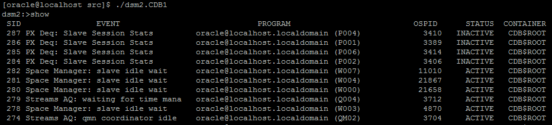
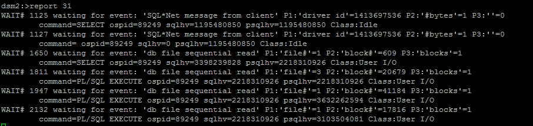

Direct Session Memory Monitor (dsm2)
===================================

Direct SGA access without SQL for Oracle RDBMS

Dsm2 is free software: you can redistribute it and/or modify
it under the terms of the GNU General Public License as published by
the Free Software Foundation, either version 3 of the License, or
(at your option) any later version.
Dsm2 is distributed in the hope that it will be useful,
but WITHOUT ANY WARRANTY; without even the implied warranty of
MERCHANTABILITY or FITNESS FOR A PARTICULAR PURPOSE.  See the
GNU General Public License for more details.

You should have received a copy of the GNU General Public License
along with dsm2.  If not, see <http://www.gnu.org/licenses/>.

### AUTHOR

 Neil C
	
### WHAT IS DSM2?
	
A light weight cli which enables DBA's to list/trace any session in real time directly 
through the SGA. 

### ON WHAT OS, ORACLE RELEASE DOES IT RUN?

 Any Linux distro upto kernel v4.1 running Oracle versions >= 12.1.0.1
 
### SAMPLE OUTPUT


	

	
### NOTES
	 
 * To run initdsma.bsh you need to be able to connect to Oracle DB with SYSDBA privileges 
 * The environment can be configured by running ". oraenv"
 * You only need to re-run initdsm2.bsh to recompile dsm2 after the database is bounced/restarted
 * DBNAME implies the INSTANCE_NAME of the Container DB.
 * From 12.2 onwards, by default only the Oracle software owner can connect to the SGA mapped file
 
### INSTALLING

* extract dsm2 

```bash
$> tar -zxvf dsm2-*.tar.gz

or

$> gunzip dsm2-*.zip
```

 *  Set the permission of initdsm2.bsh

```bash
$> chmod 775 initdsm2.bsh
``` 

 *  Run initdsm2.bsh to compile for a given database

```bash

$> ./compile_dsm2.bsh -d <DBNAME>

This will compile an executable named: dsm2.<DBNAME>
```

### EXAMPLES

 * Run dsm2 for a given database, our example uses a DB called "orc"
```
$> ./dsm2.orc
    
dsm2:>

```
### From within the dsm2 prompt:

 * Show help
```bash
dsm2:> help
```

 * Show ALL sessions
```bash
dsm2:> show
```

 * Show only active sessions
```bash
dsm2:> show active
```

 * Show only INACTIVE sessions
```bash
dsm2:> show inactive
```

 * Show detailed stats for a given session
```bash
dsm2:> report <SID>
```

